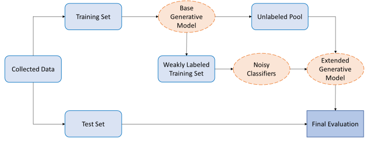

# Predicting the Demographics of Twitter Users with Programmatic Weak Supervision 

This repository contains the code implementation of the paper "redicting the Demographics of Twitter Users with Programmatic Weak Supervision", written by Jonathan Tonglet and Astrid Jehoul in 2021-2022 under the supervision of Manon Reusens and Prof. Dr. Bart Baesens. The paper is part of a research project conducted in partnership with Statistiek Vlaanderen, represented by Dr. Michael Reusens. 

  

## Demographic Inference results

| Model | Gender Acc | Gender F1 | Age Acc | Age F1 | Location Acc | Location F1 |
| --- | --- |  --- |  --- | --- | --- | --- |
| Base Generative | 0.84 |  0.59 | 0.08 | 0.16 | 0.51 | 0.61 |
| Mode | 0.69 | 0.4 |  0.52 | 0.17 | 0.34 | 0.073 |
| M3  | 0.92 | 0.9 | 0.55 | 0.37 | - | - | 
| Extended Generative | 0.92 |  0.9 | 0.55 | 0.41 | 0.75 | 0.69 |

Acc = accuracy;
F1 = macro F1-score

## Structure of the repository

  
- *Classifiers*:  Create a feature matrix and train the noisy classifiers on the weakly labeled training set.
- *Data_Collection*: Collect data from the Twitter Academic Research API and format it in a Pandas DataFrame. Data collection code is largely inspired from [this](https://towardsdatascience.com/an-extensive-guide-to-collecting-tweets-from-twitter-api-v2-for-academic-research-using-python-3-518fcb71df2a) excellent online tutorial. Includes code to identify active user accounts, perform a train-test split and remove company accounts from the training set.
- *Data_Labeling*: Create Labeling Functions (LFs) and a weakly labeled training set using the Snorkel generative label model. It also includes keywords lists and knowledge sources used by the LFs.
- *Demographic_Inference*: Perform demographic inference with the Extended Generative Model or the [M3](https://github.com/euagendas/m3inference) model.
- *Selection_Bias_Correction*: Correct selection bias using a resampling method and compute the Twitter inclusion probabilities.
  
  

  
## Data Access

For privacy reasons, the Twitter data collected for the Thesis experiments cannot be shared online. However, aggregated demographic predictions are available [here](https://github.com/jtonglet/Twitter-Selection-Bias/blob/main/Selection_Bias_Correction/Census_Demographics_Twitter.csv).
  
## Requirements

  
This repository requires Python 3.8. The list of required packages can be found in *requirements.txt*
  
  

## Contact
Jonathan Tonglet jonathan.tonglet@gmail.com 
Astrid Jehoul    as.jehoul@gmail.com 

